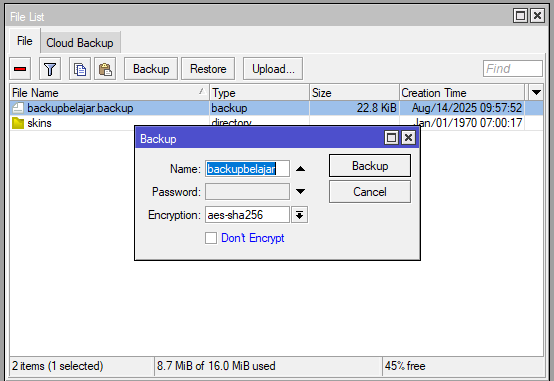
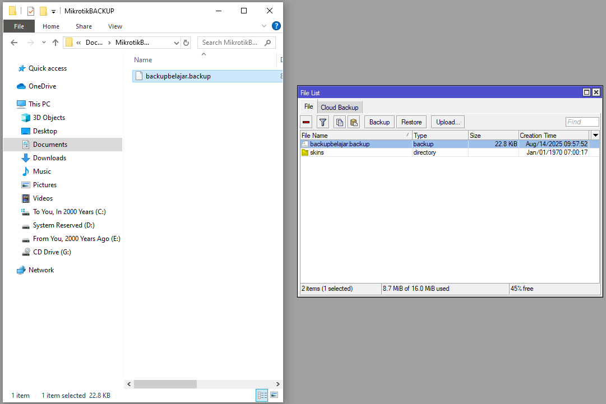
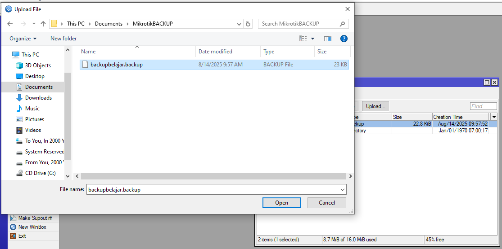

# LAB-11-Backup-dan-Restore-pada-Mikrotik
Kamis 14 Agustus 2025

# Backup dan Restore pada Mikrotik
  Backup dan Restore adalah peti besi yang dapat diandalkan untuk menyimpan seluruh konfigurasi tanpa pengecualian.l File yang dihasilkan memiliki ekstensi ***.backup**. Backup membuat file yang berisi semua setting, password, script, firewall rules, dll. Sifatnya Binary, yang artinya tidak bisa dibaca atau edit manual. Menyimpan semua konfigurasi, termasuk user dan password.  
  Untuk mencegah hal-hal yang tidak diinginkan, disarankan untuk selalu melakukan backup terhadap konfigurasi router secara berkala. Cara paling mudah untuk melakukan backup adalah dengan masuk ke **Files** pada Winbox, kemudian klik tombol **Backup**.  

    
  
  JIka melalui CLI bisa dengan perintah.  

      system backup save name="basic-config"
    
  Namun belum cukup disitu saja, konfigurasi memang telah terbackup namun file backup masih tersimpan di storage router. Jika router diinstall ulang dengan NetInstall file backup akan ilang karna proses Netinstall melakukan format storage router. Agar tidak hilang, pindahkan file backup ke windows, bisa langsung di drag dari winbox dan drop ke windows.  

  
  
  Selain drag and drop kita juga bisa mengunakan FileZilla.  
  Jika suatu saat ingin kembali ke konfig sebelumnya, bisa masuk ke **Files** di Winbox dan klik **Upload** lalu cari dan pilih file backup ke router, kemudian klik **Restore**. Atau bisa juga langsung Drag&Dron file dari WInExplor ke Files WInbox.    
    

# Kesimpulan
  Backup and Restore sangat disarankan untuk selalu dilakukan secara berkala untuk menghindari hal yang tidak diinginkan. Filenya ber ekstensi .backup dan sifatnya binary, yang artinya tidak bisa dibaca atau edit manual.  Disarankan untuk reouter yang sama atau dengan seri dan tipe yang identik.
